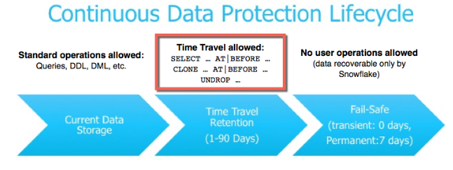
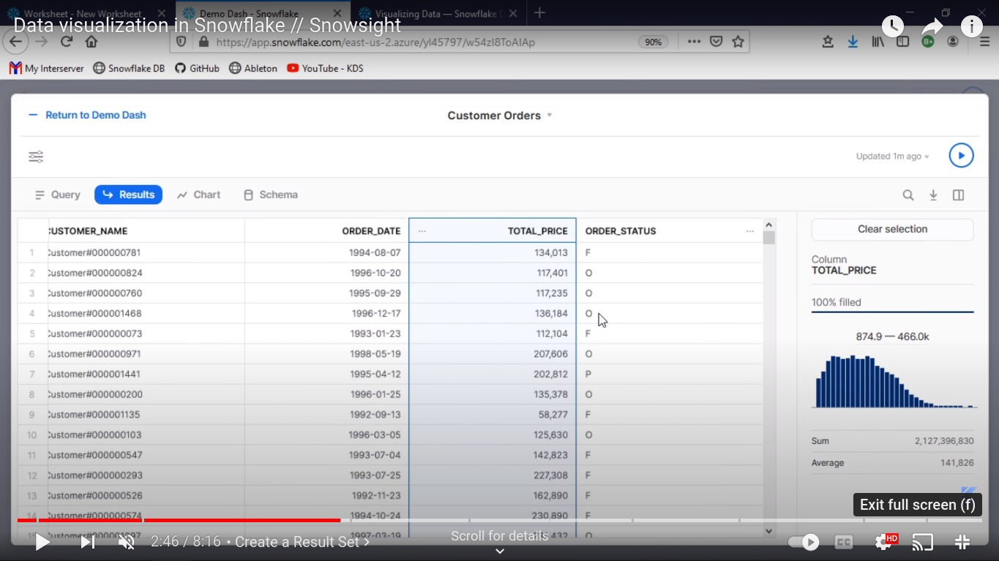
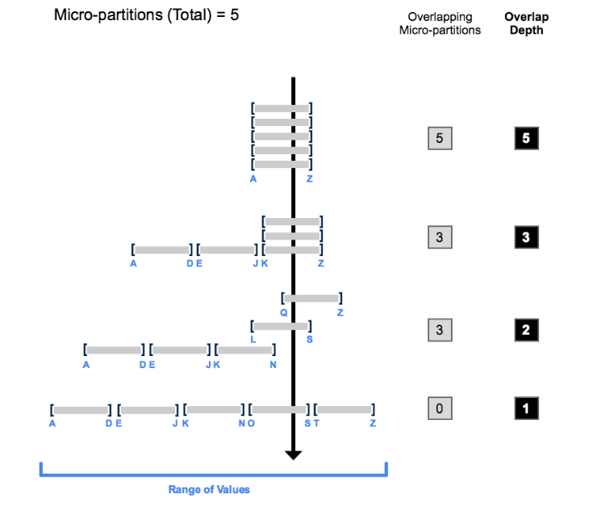
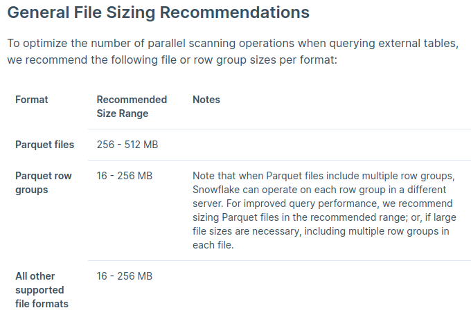

# snowflake_interview_preparation

## Theorical Questions Section

### Theorical Question 0

Do you understand what time travel is

<b>Answer</b>

Snowflake Time Travel enables accessing historical data (i.e. data that has been changed or deleted) at any point within a defined period. 

<b>Source</b>

https://docs.snowflake.com/en/user-guide/data-time-travel

### Theorical Question 1

Do you know what the data retention period is

<b>Answer</b>

When data in a table is modified, including deletion of data or dropping an object containing data, Snowflake preserves the state of the data before the update. The data retention period specifies the number of days for which this historical data is preserved and, therefore, Time Travel operations (SELECT, CREATE … CLONE, UNDROP) can be performed on the data.

The standard retention period is 1 day (24 hours) and is automatically enabled for all Snowflake accounts

<b>Source</b>

https://docs.snowflake.com/en/user-guide/data-time-travel

### Theorical Question 2

Do you know what the fail-safe is

<b>Answer</b>

Separate and distinct from Time Travel, Fail-safe ensures historical data is protected in the event of a system failure or other event (e.g. a security breach).

When a table, schema, or database is dropped, it is not immediately overwritten or removed from the system. Instead, it is retained for the data retention period for the object, during which time the object can be restored. Once dropped objects are moved to Fail-safe, you cannot restore them.

<b>Source</b>

https://docs.snowflake.com/en/user-guide/data-time-travel

### Theorical Question 3

Do you know what alter database refres does

<b>Answer</b>

Refreshes a secondary database from a snapshot of its primary database. A snapshot includes changes to the objects and data.

<b>Source</b>

https://docs.snowflake.com/en/sql-reference/sql/alter-database

### Theorical Question 4

Do you understand the difference between cascade and restrict when you drop a database

<b>Answer</b>

Specifies whether the database can be dropped if foreign keys exist that reference any tables in the database:

CASCADE drops the database and all objects in the database, including tables with primary/unique keys that are referenced by foreign keys in other tables.

RESTRICT returns a warning about existing foreign key references and does not drop the database.

<b>Source</b>

https://docs.snowflake.com/en/sql-reference/sql/drop-database

### Theorical Question 5

Do you understand what a resource monitor is

<b>Answer</b>

To help control costs and avoid unexpected credit usage caused by running warehouses, Snowflake provides resource monitors. A virtual warehouse consumes Snowflake credits while it runs.

A resource monitor can be used to monitor credit usage by virtual warehouses and the cloud services needed to support those warehouses. If desired, the warehouse can be suspended when it reaches a credit limit.

The number of credits consumed depends on the size of the warehouse and how long it runs.

Limits can be set for a specified interval or date range. When these limits are reached and/or are approaching, the resource monitor can trigger various actions, such as sending alert notifications and/or suspending user-managed warehouses.

<b>Source</b>

https://docs.snowflake.com/en/user-guide/resource-monitors

### Theorical Question 6

Do you know what snowsight is

<b>Answer</b>

The Snowflake Web Interface

<b>Source</b>

https://docs.snowflake.com/en/user-guide/ui-snowsight

### Theorical Question 7

How would you know what is the minimun and maximun value and how many records you have for all of the values in a column from snowsight

<b>Answer</b>

<b>Source</b>

https://www.youtube.com/watch?v=qdgl1u7UVpU

https://docs.snowflake.com/en/user-guide/ui-snowsight-query

### Theorical Question 8

Do you know what replication is in snowflake

<b>Answer</b>

This feature enables the replication of objects from a source account to one or more target accounts in the same organization. Replicated objects in each target account are referred to as secondary objects and are replicas of the primary objects in the source account. Replication is supported across regions and across cloud platforms.

A replication group is a defined collection of objects in a source account that are replicated as a unit to one or more target accounts. Replication groups provide read-only access for the replicated objects.

A failover group is a replication group that can also fail over. A secondary failover group in a target account provides read-only access for the replicated objects. When a secondary failover group is promoted to become the primary failover group, read-write access is available. Any target account specified in the list of allowed accounts in a failover group can be promoted to serve as the primary failover group.

Replication and failover groups provide point-in-time consistency for the objects on the target account.

<b>Source</b>

https://docs.snowflake.com/en/user-guide/account-replication-intro#label-replicated-database-objects

### Theorical Question 9

Why would you go with micro-partitions(snowflkae) instead of partitions (everything else)

<b>Answer</b>

Traditional data warehouses rely on static partitioning of large tables to achieve acceptable performance and enable better scaling. In these systems, a partition is a unit of management that is manipulated independently using specialized DDL and syntax; however, static partitioning has a number of well-known limitations, such as maintenance overhead and data skew, which can result in disproportionately-sized partitions.

In contrast to a data warehouse, the Snowflake Data Platform implements a powerful and unique form of partitioning, called micro-partitioning, that delivers all the advantages of static partitioning without the known limitations, as well as providing additional significant benefits.

The benefits of Snowflake’s approach to partitioning table data include:

In contrast to traditional static partitioning, Snowflake micro-partitions are derived automatically; they don’t need to be explicitly defined up-front or maintained by users.

As the name suggests, micro-partitions are small in size (50 to 500 MB, before compression), which enables extremely efficient DML and fine-grained pruning for faster queries.

Micro-partitions can overlap in their range of values, which, combined with their uniformly small size, helps prevent skew.

Columns are stored independently within micro-partitions, often referred to as columnar storage. This enables efficient scanning of individual columns; only the columns referenced by a query are scanned.

Columns are also compressed individually within micro-partitions. Snowflake automatically determines the most efficient compression algorithm for the columns in each micro-partition.

<b>Source</b>

https://docs.snowflake.com/en/user-guide/tables-clustering-micropartitions

### Theorical Question 10

Do you know what clustering is in snowflake

<b>Answer</b>

Typically, data stored in tables is sorted/ordered along natural dimensions (e.g. date and/or geographic regions). This “clustering” is a key factor in queries because table data that is not sorted or is only partially sorted may impact query performance, particularly on very large tables.

In Snowflake, as data is inserted/loaded into a table, clustering metadata is collected and recorded for each micro-partition created during the process. Snowflake then leverages this clustering information to avoid unnecessary scanning of micro-partitions during querying, significantly accelerating the performance of queries that reference these columns.

<b>Source</b>

https://docs.snowflake.com/en/user-guide/tables-clustering-micropartitions

### Theorical Question 11

Do you know what clustering is in snowflake

<b>Answer</b>

Typically, data stored in tables is sorted/ordered along natural dimensions (e.g. date and/or geographic regions). This “clustering” is a key factor in queries because table data that is not sorted or is only partially sorted may impact query performance, particularly on very large tables.

In Snowflake, as data is inserted/loaded into a table, clustering metadata is collected and recorded for each micro-partition created during the process. Snowflake then leverages this clustering information to avoid unnecessary scanning of micro-partitions during querying, significantly accelerating the performance of queries that reference these columns.

<b>Source</b>

https://docs.snowflake.com/en/user-guide/tables-clustering-micropartitions

### Theorical Question 12

Do you know what clustering dept is in snowflake

<b>Answer</b>

The clustering depth for a populated table measures the average depth (1 or greater) of the overlapping micro-partitions for specified columns in a table. The smaller the average depth, the better clustered the table is with regards to the specified columns.

Clustering depth can be used for a variety of purposes, including:

Monitoring the clustering “health” of a large table, particularly over time as DML is performed on the table.

Determining whether a large table would benefit from explicitly defining a clustering key.

A table with no micro-partitions (i.e. an unpopulated/empty table) has a clustering depth of 0.

Note

The clustering depth for a table is not an absolute or precise measure of whether the table is well-clustered. Ultimately, query performance is the best indicator of how well-clustered a table is:

If queries on a table are performing as needed or expected, the table is likely well-clustered.

If query performance degrades over time, the table is likely no longer well-clustered and may benefit from clustering.

A potential solution for big clustering depth is a clustering key

<b>Source</b>

https://docs.snowflake.com/en/user-guide/tables-clustering-micropartitions

### Theorical Question 13

What are the Considerations for Choosing Clustering for a Table

<b>Answer</b>

Whether you want faster response times or lower overall costs, clustering is best for a table that meets all of the following criteria:

The table contains a large number of micro-partitions. Typically, this means that the table contains multiple terabytes (TB) of data.

The queries can take advantage of clustering. Typically, this means that one or both of the following are true:

The queries are selective. In other words, the queries need to read only a small percentage of rows (and thus usually a small percentage of micro-partitions) in the table.

The queries sort the data. (For example, the query contains an ORDER BY clause on the table.)

A high percentage of the queries can benefit from the same clustering key(s). In other words, many/most queries select on, or sort on, the same few column(s).

If your goal is primarily to reduce overall costs, then each clustered table should have a high ratio of queries to DML operations (INSERT/UPDATE/DELETE). This typically means that the table is queried frequently and updated infrequently. If you want to cluster a table that experiences a lot of DML, then consider grouping DML statements in large, infrequent batches.

Also, before choosing to cluster a table, Snowflake strongly recommends that you test a representative set of queries on the table to establish some performance baselines.

A single clustering key can contain one or more columns or expressions. For most tables, Snowflake recommends a maximum of 3 or 4 columns (or expressions) per key. Adding more than 3-4 columns tends to increase costs more than benefits.

Selecting the right columns/expressions for a clustering key can dramatically impact query performance. Analysis of your workload will usually yield good clustering key candidates.

Snowflake recommends prioritizing keys in the order below:

Cluster columns that are most actively used in selective filters. For many fact tables involved in date-based queries (for example “WHERE invoice_date > x AND invoice date <= y”), choosing the date column is a good idea. For event tables, event type might be a good choice, if there are a large number of different event types. (If your table has only a small number of different event types, then see the comments on cardinality below before choosing an event column as a clustering key.)

If there is room for additional cluster keys, then consider columns frequently used in join predicates, for example “FROM table1 JOIN table2 ON table2.column_A = table1.column_B”.

If you typically filter queries by two dimensions (e.g. application_id and user_status columns), then clustering on both columns can improve performance.

The number of distinct values (i.e. cardinality) in a column/expression is a critical aspect of selecting it as a clustering key. It is important to choose a clustering key that has:

A large enough number of distinct values to enable effective pruning on the table.

A small enough number of distinct values to allow Snowflake to effectively group rows in the same micro-partitions.

A column with very low cardinality (e.g. a column that indicates only whether a person is male or female) might yield only minimal pruning. At the other extreme, a column with very high cardinality (e.g. a column containing nanosecond timestamp values) is also typically not a good candidate to use as a clustering key directly.

<b>Source</b>

https://docs.snowflake.com/en/user-guide/tables-clustering-keys

### Theorical Question 14

why you should delete the temporary tables

<b>Answer</b>

For the duration of the existence of a temporary table, the data stored in the table contributes to the overall storage charges that Snowflake bills your account. To prevent any unexpected storage changes, particularly if you create large temporary tables in sessions that you maintain for periods longer than 24 hours, Snowflake recommends explicitly dropping these tables once they are no longer needed. 

<b>Source</b>

https://docs.snowflake.com/en/user-guide/tables-temp-transient

### Theorical Question 15

Do you understand what is a external table in 

<b>Answer</b>

An external table is a Snowflake feature that allows you to query data stored in an external stage as if the data were inside a table in Snowflake. The external stage is not part of Snowflake, so Snowflake does not store or manage the stage.

Querying data in an external table might be slower than querying data that you store natively in a table within Snowflake. To improve query performance, you can use a materialized view based on an external table.

We strongly recommend partitioning your external tables, which requires that your underlying data is organized using logical paths that include date, time, country, or similar dimensions in the path. Partitioning divides your external table data into multiple parts using partition columns.

An external table definition can include multiple partition columns, which impose a multi-dimensional structure on the external data. Partitions are stored in the external table metadata.

<b>Source</b>

https://docs.snowflake.com/en/user-guide/tables-temp-transient

### Theorical Question 16

Do you know what the search optimization service is 

<b>Answer</b>

The search optimization service aims to significantly improve the performance of certain types of queries on tables, including:

Selective point lookup queries on tables. A point lookup query returns only one or a small number of distinct rows. Use case examples include:

Business users who need fast response times for critical dashboards with highly selective filters.

Data scientists who are exploring large data volumes and looking for specific subsets of data.

Data applications retrieving a small set of results based on an extensive set of filtering predicates.

Substring and regular expression searches (e.g. LIKE, ILIKE, RLIKE, etc.).

Queries on fields in VARIANT, OBJECT, and ARRAY columns that use certain types of predicates (equality predicates, IN predicates, predicates that use ARRAY_CONTAINS and ARRAYS_OVERLAP, and predicates that check for NULL values).

Queries that use selected geospatial functions with GEOGRAPHY values.

Once you identify the queries that can benefit from the search optimization service, you can configure search optimization for the columns and tables used in those queries.

<b>Source</b>

https://docs.snowflake.com/en/user-guide/search-optimization-service#label-search-optimization-service-when-should-you-use-search-paths

### Theorical Question 17

What is a View ?

<b>Answer</b>

A view allows the result of a query to be accessed as if it were a table. The query is specified in the CREATE VIEW statement.

Views serve a variety of purposes, including combining, segregating, and protecting data. 

A view can be used almost anywhere that a table can be used (joins, subqueries, etc.).

A non-materialized view’s results are created by executing the query at the time that the view is referenced in a query. The results are not stored for future use. Performance is slower than with materialized views.

<b>Source</b>

https://docs.snowflake.com/en/user-guide/views-introduction

### Theorical Question 18

What is a secuure View ?

<b>Answer</b>

For a non-secure view, internal optimizations can indirectly expose data.

Some of the internal optimizations for views require access to the underlying data in the base tables for the view. This access might allow data that is hidden from users of the view to be exposed through user code, such as user-defined functions, or other programmatic methods. Secure views do not utilize these optimizations, ensuring that users have no access to the underlying data.

For a non-secure view, the view definition is visible to other users.

By default, the query expression used to create a standard view, also known as the view definition or text, is visible to users in various commands and interfaces. For details, see Interacting with Secure Views (in this topic).

For security or privacy reasons, you might not wish to expose the underlying tables or internal structural details for a view. With secure views, the view definition and details are visible only to authorized users

<b>Source</b>

https://docs.snowflake.com/en/user-guide/views-introduction

### Theorical Question 19

Table design considerations

<b>Answer</b>

https://docs.snowflake.com/en/user-guide/table-considerations

<b>Source</b>

https://docs.snowflake.com/en/user-guide/table-considerations

### Theorical Question 20

Do you know what is the query profile

<b>Answer</b>

Query Profile is a powerful tool for understanding the mechanics of queries. It can be used whenever you want or need to know more about the performance or behavior of a particular query. It is designed to help you spot typical mistakes in SQL query expressions to identify potential performance bottlenecks and improvement opportunities.

<b>Source</b>

https://docs.snowflake.com/en/user-guide/ui-query-profile

### Theorical Question 20

Do you know what is a stage in snowflake

<b>Answer</b>

Query Profile is a powerful tool for understanding the mechanics of queries. It can be used whenever you want or need to know more about the performance or behavior of a particular query. It is designed to help you spot typical mistakes in SQL query expressions to identify potential performance bottlenecks and improvement opportunities.

<b>Source</b>

https://docs.snowflake.com/en/user-guide/ui-query-profile

### Theorical Question 21

Do you know what is the query accelerator service

<b>Answer</b>

The query acceleration service can accelerate parts of the query workload in a warehouse. When it is enabled for a warehouse, it can improve overall warehouse performance by reducing the impact of outlier queries, which are queries that use more resources than the typical query. The query acceleration service does this by offloading portions of the query processing work to shared compute resources that are provided by the service.

<b>Source</b>

https://docs.snowflake.com/en/user-guide/query-acceleration-service

### Theorical Question 22

How could you identify queries that could benefit from the query accelerator service

<b>Answer</b>

The query acceleration service can accelerate parts of the query workload in a warehouse. When it is enabled for a warehouse, it can improve overall warehouse performance by reducing the impact of outlier queries, which are queries that use more resources than the typical query. The query acceleration service does this by offloading portions of the query processing work to shared compute resources that are provided by the service.

<b>Source</b>

https://docs.snowflake.com/en/user-guide/query-acceleration-service#label-identifying-queries-warehouses-for-qas

### Theorical Question 23

What do you interpret of the following monitoring load grapghs ?

<b>Answer</b>

https://docs.snowflake.com/en/user-guide/warehouses-load-monitoring#slow-query-performance

<b>Source</b>

https://docs.snowflake.com/en/user-guide/warehouses-load-monitoring#slow-query-performance

### Theorical Question 24

How would you monitor the clustering of a table ?

<b>Answer</b>

https://docs.snowflake.com/en/user-guide/tables-clustering-micropartitions#monitoring-clustering-information-for-tables

<b>Source</b>

https://docs.snowflake.com/en/user-guide/tables-clustering-micropartitions#monitoring-clustering-information-for-tables

### Theorical Question 25

What type of operations benefit from clustering keys (in big tables) ?

<b>Answer</b>

Operations that do sort_functions like the order by, group by and join operations

<b>Source</b>

https://docs.snowflake.com/en/user-guide/tables-clustering-keys#benefits-of-defining-clustering-keys-for-very-large-tables

### Theorical Question 26

How can you tell if the materialized view is been used when you execute a query ?

<b>Answer</b>

by using the explain command

<b>Source</b>

https://docs.snowflake.com/en/user-guide/views-materialized#planning-to-create-a-materialized-view

### Theorical Question 27

Do you know what a zero copy clone is ?

<b>Answer</b>

Snowflake’s zero-copy cloning feature provides a convenient way to quickly take a “snapshot” of any table, schema, or database and create a derived copy of that object which initially shares the underlying storage. This can be extremely useful for creating instant backups that do not incur any additional costs (until changes are made to the cloned object).

<b>Source</b>

__________________

### Theorical Question 28

what the snowpipe is ?

<b>Answer</b>

Snowpipe enables loading data from files as soon as they’re available in a stage. This means you can load data from files in micro-batches, making it available to users within minutes, rather than manually executing COPY statements on a schedule to load larger batches.

<b>Source</b>

https://docs.snowflake.com/en/user-guide/data-load-snowpipe-intro

### Theorical Question 29

Do you understand why primary key and foreign key are so important ?

<b>Answer</b>

https://docs.snowflake.com/en/user-guide/join-elimination

<b>Source</b>

https://docs.snowflake.com/en/user-guide/join-elimination

